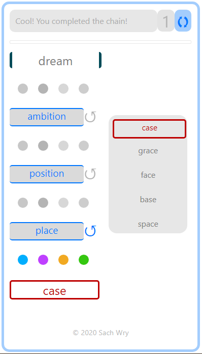

# About using this

[Pod](https://github.com/mileallen/pod/) is a class that supplies a number of helper methods to manipulate the DOM, to match the way most JS frameworks do. It is specifically meant for lightweight web pages that you would like to design like an app, in a declarative way, but without the costs of a framework. It's a 'vanilla' Pod, get it? Sorry. 😁 

You can design components inside templates that will be rendered on demand. Elements can have their text content or an attribute bound to a proxy variable, which you declare right in the markup. For `input` and `textarea` elements, the binding is of-course two-way. You might notice that the markup syntax is influenced by frameworks like Vue for a quick learning curve.

A demonstration as a word-linking game app is [here](https://pod.js.org/verba/). It is <25 Kb in all of uncompressed HTML, CSS and JS. And of course, the obligatory [todo app](https://pod.js.org/todos/).

[](https://pod.js.org/verba/)

## How it works

Within a webpage, Pod will look for specific declarations within the scope you assign to it. The scope is set by passing the ID of the parent element ('the wrapper') when declaring. This will represent the 'app' portion of your web page or web app.

`<div id="appW" class="">... the rest of your HTML ... </div>`

In your own JS code assign the Pod class to a convenient name. (Include Pod.js before this assignment.) 

`const app = new Pod('appW')`

If you have an initial set of variables to assign, pass them as properties in an object as the second argument.

`const app = new Pod('appW', {todos: arrayVar, theme: 'dark'} )`


## Survey 1

When initialised thus, the class surveys the children of the wrapper for a number of attributes: 'Survey 1' looks for `pText`, `pMod`, `pBind`, `pFor` and `pRef`.

### pText

This attribute names a variable that will correspond to innerHTML for the element.

`<span pText="textVar1"> Original text here is boring.</span>`

### pMod

This turns an input or textarea element into a two-way data model. The value is stored in the variable named by the attribute and is maintained in sync with the input value.

`<input type="range" pMod="classTheme">`

### pBind

This binds the value of another attribute specified to the variable named. The syntax is 'attribute:variable' , no space. When you set `uriVar1`, the 'href' attribute below is updated to the string you pass.

`<a pMod="href:uriVar1">`


### pRefs

This is simply to add meaningful identifiers to elements. Obviously it doesn't do much that `querySelector` cannot. It is just to add consistency to your app's syntax for readability. 

`<div pRef="scorePanel"></div>`


Now you can use all those watched attributes.

```

app.textVar1 = 'This new text is exciting!' 

app.classTheme = 'theme0'

app.uriVar1 = `https://google.com/q=${app12.searchStringVar1}`

app.scorePanel.style.opacity = 0

```

### pFor

This is to handle Array data. Below is an example of usage from the included demo game app. The game looks up word relations on an API from datamuse.com. When the fetch 'promise' is fulfilled, the API retuns JSON with a list of words that meet the criterion, and for each word, a `score` property and another that counts the number of syllables in the word. The JSON list of words is assigned to the variable `qWords`. We want each word to be displayed, with a function invoked `onclick`, to which we pass the selected word. We also wish to assign a couple of conditional classes depending on whether the word was picked to proceed to the next link or not.

Here is how you achieve that:

```

<div class="grid2">
    <template pFor="qWords">
    <div class="fetched" data-pick="false" data-kick="false" data-matched="false">
        <div class="" pText="qWord.word" pBind="idx=qWord.word" onclick="pickword(this.getAttribute('idx'))"> </div>
    </div> </template>
</div>

```
The template content itended for items should be inside a single outer container `div`. Above, that is where we have assigned the class `fetched`. The template tag itself should also be enclosed in a single div all its own, with no other content within it. As is the case in the game snippet with the `div` assigned the class `grid2`.

So you want:

```
<div>
    <template>
    <div>
            ... your intended template markup...
    </div> 
    </template>
</div>
```

Note that the template is rendered for each item in the array, and each component is actually a Pod class in itself, though not exposed to the user directly. As such, the parent `div` in the template is its 'wrapper'. That is why you see the `data-` variables declared on it, to assign those conditional classes the same way as the main app wrapper (see the section 'Classes' below).

To add, delete items or to update individual proteties on items, you can use the following methods:

```
app.qWords.add( {key1: value1, key2: value2...}, [index] )

app.qWords.delete(index)

app.qWords.set(index, key, value)

```

With `.add()`, `index` is optional. If omitted, the item is appended at the end of the array. To assign one of those `data-` variables above, for instance, you would use

`app.qWords.set(index, 'matched', true)`

Tip: If you don't intend to render templates based on any array data, you can use pod-lite.js, a much lighter Pod class.


## Survey 2

Survey 2 looks for component containers and templates, i.e., `pShow`s, `pComp`s and `compid`s.

### pShow

Use this to show or hide a component template in its place. Add the `pShow` attribute to the `div` that will contain the template.

```
<div pShow="componentVar0">
<template> 
<div id="componentContainer1">
... your template markup...
</div>
</template>
</div>

```

### pComp & compid

The former attribute marks a container `div` that can switch between mutiple components. Each alternative is declared in its own template, in turn marked with a `compid` attribute. Note: these `compid` templates need to be inside the scope of the wrapper `div`.

As with `pFor`, for all templates, be sure to put your component inside a single outer container div. It's ID is immaterial to Pod.

```
<div pComp="componentVar1"> </div>

... other markup ...

<template compid="viewVar1"> <div id="componentContainer2">
.... your template markup .... 
</div>
<template>

<template compid="viewVar2"><div id="componentContainer">
.... the other template markup .... 
</div>
<template>

</div></body>

```

For both, `pShow` and `pComp`, rendering the template is again, just the simple matter of setting the variable specified. For `pShow`, the variable is boolean. For `pComp`, assign the corresponding `compid`.

```
app.componentVar0 = true

app.componentVar1 = viewVar2

```

## Classes

For switching classes, Pod leverages stylesheet rules in cordination with `data-` variables set on the wrapper. Notice above the `input` element bound to the variable `classTheme`. Say you want that to reflect in a CSS class assigned to some other part of the app, such that the range `input` can be used to swtich that class. You do that by adding it to the wrapper declaration thus:

```
<div id="app" data-class-theme="theme0">... the rest of your HTML ... </div>
```

There. That tells Pod to pay additional attention to `classTheme` as it is now part of the `dataset` for the wrapper element. The rest is handled by CSS directly.

If the element you wish to apply this to is as below:

```
<div id="themedComponent">
<p>   <span></span></p>
<button>
</div>
```

You add the following selector:

```
#app[data-theme-choice="theme2"] #themedComponent {
    ... your CSS rules ...
}
```

Now when the range input is used to set `classTheme` (which you remember above it was bound to with `pMod`), the CSS rule takes effect on the `themedComponent` element.

### Within loops

To switch any classes accordingly for items rendered from an array, you would of course need a CSS rule for its parent wrapper element. In the case of our pFor template above, it is the outermost div. So you need a CSS rule which selects for the `fetched` class, instead of the ID `app`.

```
.fetched[data-matched=true] {
    ... your CSS rules ...
}
```
Recall from above that the required `data-` variables were already declared on the parent `div` inside the template.


# Last Word

I'm an amateur JS enthusiast. The primary motivation to put this up was the hope of hearing back from professionals about everything that is wrong with this approach. Really vicious criticism lampooning how a particular line of code is laughably wrong-headed is very welcome! [@sachwry](https://twitter.com/sachwry)
